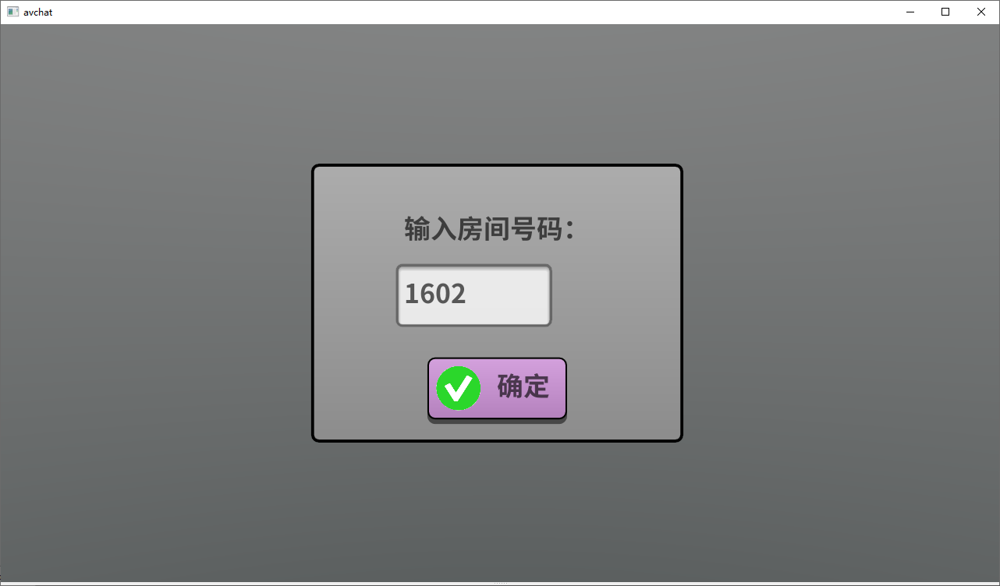
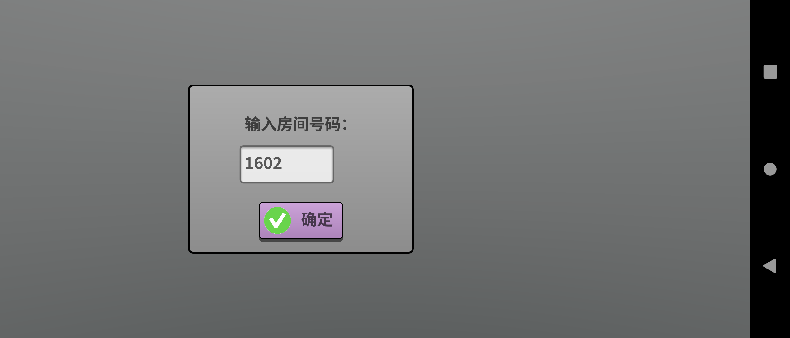
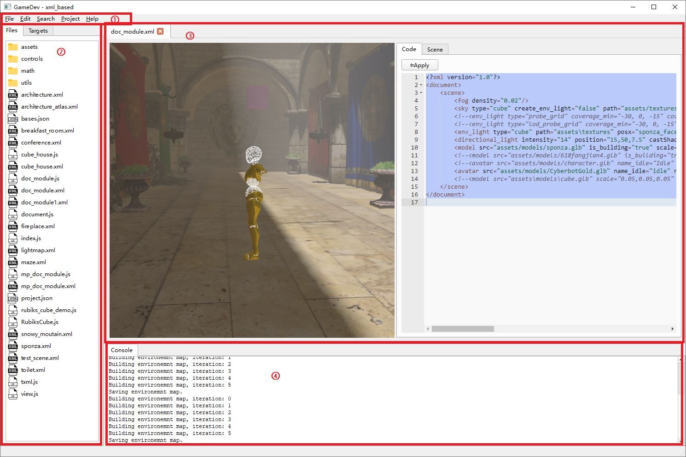
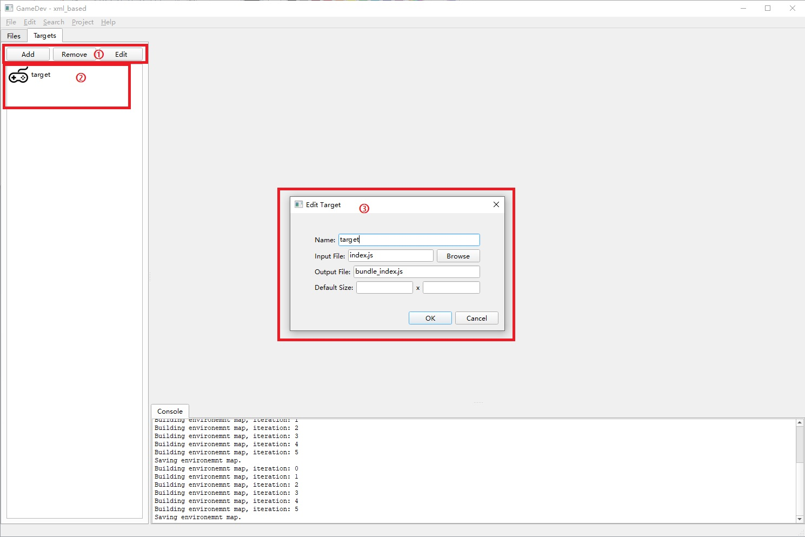
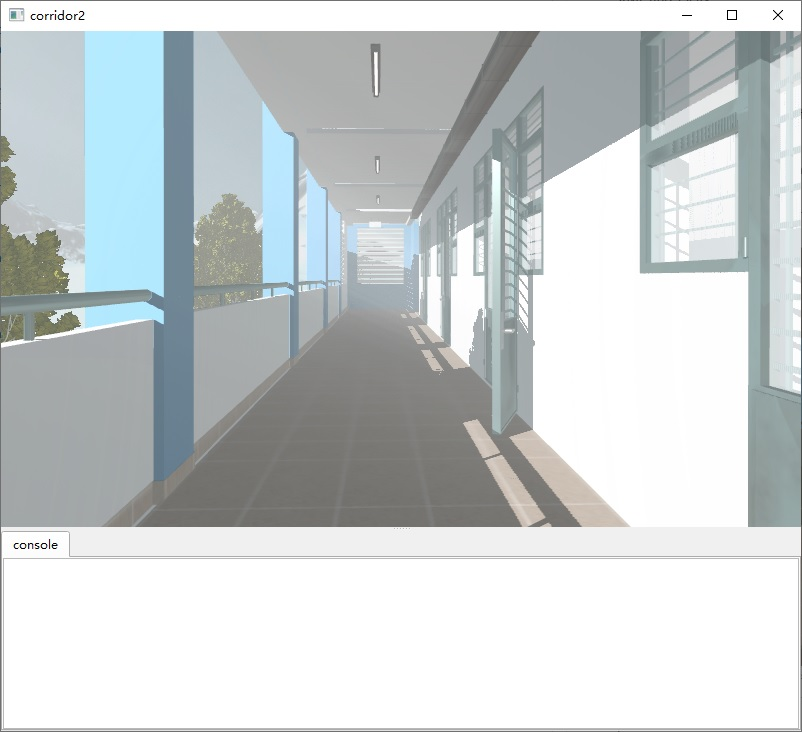

# GameDev

GameDev is an IDE for Three.V8, the JavaScript based 3D application engine.
- [GameDev](#gamedev)
  - [The Engine](#the-engine)
  - [Structure of an App](#structure-of-an-app)
  - [The IDE](#the-ide)
    - [External Dependencies](#external-dependencies)
    - [Menus](#menus)
    - [Side Bar](#side-bar)
    - [Editors](#editors)
    - [Logs](#logs)
  - [Lightmap tools](#lightmap-tools)

See [Scene Editor](scene_editor.html) for details of the XML based scene-editor.

See [Tutorial](tutorials.html) for a walk-through of creation of different type of Apps.

See [Three.V8 User Script APIs](api/index.html) for the detail of the APIs.

## The Engine

Three.V8 is a cross-platform 3D application engine. 
Developer can use the engine to develop their own cross-platform 3D applications in JavaScript. Apps developed using Three.V8 can run in all supported platforms using the engine for the specific platform. 

Three.V8 exposes its own set of engine APIs which can be called by the apps to implement their required functionalities. There is a separate documentation about the detail of the [APIs](api/index.html).

The design of the engine is similar to other script-based game engines.  However, as an application engine, Three.V8 also provides basic APIs for networking, multimedia and GUI apart from its 3D functionalities. The GUI system is based on the built-in graphics library of the engine so that the appearance of the GUI is highly consistent across different platforms.


**GUI appearance in Windows**


**GUI appearance in Android**

## Structure of an App

An app developed using Three.V8 is consisted of a code part and a data part. 
The code part can be consisted of multiple JavaScript file during development. 
However, all the code need to be bundled togather using [Rollup.js](https://rollupjs.org/) 
before it can be run with the engine. The bundling procedural is automated by the IDE.

The data part is consisted of multiple data files of arbitary formats. They should either be deployed together with the bundled code inside the final App or placed at a remote server to be downloaded at run-time. Those deployed inside the App can be referenced using paths relative to the bundled code.

## The IDE



The GUI of the IDE is consisted of ① Menu bar ② Side bar ③ Editor area and ④ Log area.

### External Dependencies

* Code editors are based on Microsoft WebView2. 
* Bundling is performed using [Rollup.js](https://rollupjs.org/). 

The IDE checkes whether WebView2 runtime is available when it starts. A installer is lauched automatically if it is not.

A pre-packaged rollup.exe is provided and used by the IDE to bundle the source code automatically.


### Menus

Use File-New-Project to create a new project. A project is a directory containing a "project.json" file. "project.json" marks the directory as a GameDev project, and maintains a list of bundle targets.

Use File-New-File to add files to the project directory. You can also right-click a directory item in the side-bar to create files at a specified position.

The editors does not reload automatically when a file is modified outside of the IDE. You can manually refresh using File-Reopen or by pressing F5.

### Side Bar

The "Files" tab provides a tree-view of the project directory. Use the context menus to create, open or delete files.

The "Targets" tab provides a list-view of the managed bundle targets. 



Use buttons at ① to add/remove bundle targets or open the "Edit Target" window ③.

Right click the Target item at ② for context menu, where you get options to run the target or create a shortcut of the App on the desktop. To run the target, you can also just double click the item. A bundling process will be triggered by calling the external "rollup" tool if a JavaScript file is modified. A separate process will be started by launching the GamePlayer passing the information of the target. Note the bundled JavaScript files are hidden in the "Files" tab, because you should never edit these files manually.

### Editors

GameDev provides editors for file formats most commonly used in a Three.V8 project, which are JavaScript, XML and JSON. 

In this IDE, we use specifically structured XML files to represent 3D Scenes and a dedicated [scene editor](scene_editor.html) is provided. Besides the basic functionality of placing object into your scene, the XML editor also integrates global illumination pre-baking functions, which is powered by a compute-shader based ray-tracing system (CWBVH).

Also see [tutorials](tutorials.html) for a walk-through of the usage of the editors.

### Logs 

Currently the "Console" tab of the log areas mainly shows outputs from the bundling process and the scene editor.

Since that a running Target has its own process (QGamePlayer.exe), their outputs can be seen in their own consoles.



The console of the GamePlayer is hidden by default, and can be shown by dragging.

## Lightmap tools

There are 2 command-line tools related to lightmaps: 

* Lightmapper.exe for creation of the 2nd UV set.

The command line looks like:

```
Lightmapper input.glb [output.glb] [texels_per_unit]
```

Both input and output are glb files. The 2nd UV set will be inserted as TEXCOORD_1.

"texels_per_unit" is a resolution hint. See [xatlas](https://github.com/jpcy/xatlas) for detail.

* LightmapCompressor.exe for compressing pre-baked lightmap images.

```
LightmapCompressor input.hdr [output_prefix] [jpeg\png\webp]
```

LightmapCompressor takes a RGBE HDR file for input. 2 compression modes are supported.

* Cascaded residual encoding using [this method](https://fynv.github.io/Cascaded-Residual-Encoding-for-HDR-Lightmap-Compression/).

This is the default mode. Pass in "jpeg" after output_prefix, or omit it.

* RGBM compression

RGBM compression requires lossless alpha. PNG and WebP can achieve that.

Pass in "png" or "webp" after output_prefix.


