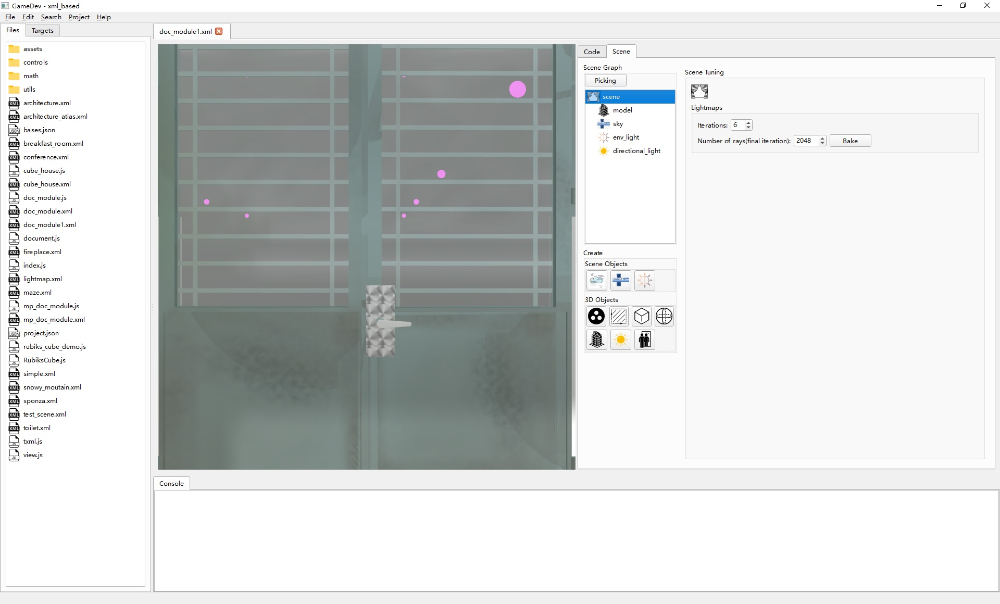
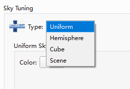
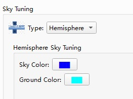
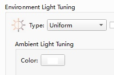
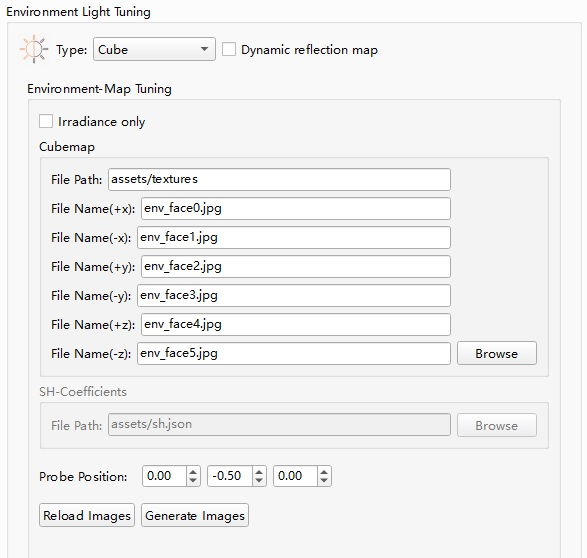
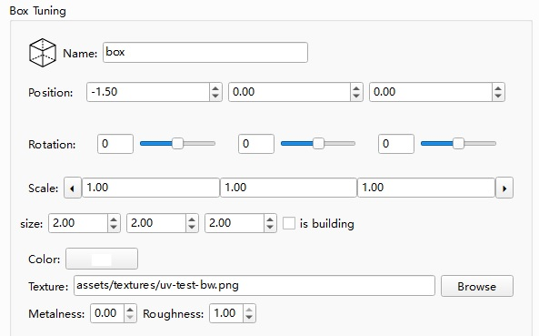
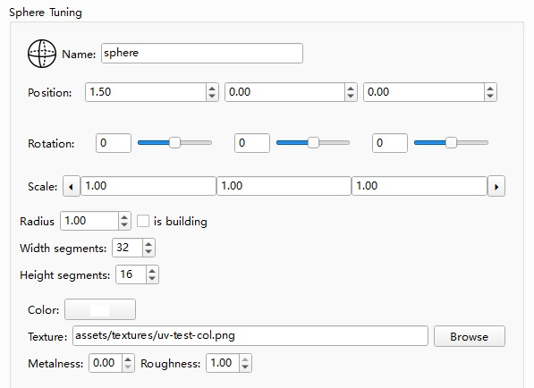
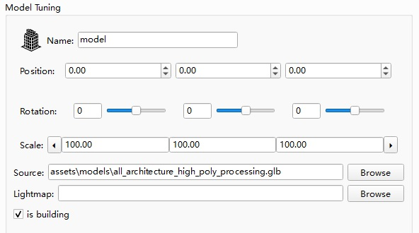

# Scene Editor

- [Scene Editor](#scene-editor)
  - [Fog Item](#fog-item)
  - [Sky Item](#sky-item)
    - [Uniform](#uniform)
    - [Hemisphere](#hemisphere)
    - [Cube](#cube)
    - [Scene](#scene)
  - [Environment Light Item](#environment-light-item)
    - [Uniform](#uniform-1)
    - [Hemisphere](#hemisphere-1)
    - [Cube](#cube-1)
    - [Probe-Grid](#probe-grid)
    - [LOD Probe-Grid](#lod-probe-grid)
  - [Group Item](#group-item)
  - [Plane/Box/Sphere Items](#planeboxsphere-items)
  - [Model Item](#model-item)
  - [Directional Light Item](#directional-light-item)

Three.V8 does not specify how a scene is represented in external storage, which can be decided by each App (user script). However, the IDE has a built-in support for a specific XML format and provides a visualized interface to edit the scene, which is being described here. To support this XML format in your app, you can start with the "project_template" provided with GameDev.

The visualized scene editor is opened when you open a XML file in the IDE. 
On the left side of the editor, you will see the scene preview ①. On the right side, the "Code" tab is activated by default, where you can edit the XML code directly. However, the "Scene" tab is of more interest, where you can tweak the content of the XML file by controls. The changes are synchronized between the tabs. 

On the "Scene" tab, you can find the "Scene Graph" group ② where you can select the items currently present in the scene. To select an item, you can either click it in the tree-view or click the "Picking" button then pick it inside the left view. Once an item is selected, you can edit the properties of the item on the right side ④. 

Using the tool buttons in the "Create..." group ③, you can add new items into the scene.

Basically, you first select an existing item as the parent item, then click a tool button to create an item. There are 2 kinds of items you can create this way, scene-items and 3D-items. Scene items are unique to a scene and the parent item must be "scene". 3D Items can be placed either under "scene" or under an existing 3D Item.

## Fog Item

The fog item describes particle scattering material in the air across the scene. It can be used to obscure the objects at a far distance, and is all essential for generating the Tyndall effect. The Fog Item has 2 properties, density and color. The bigger the density is, the faster the light attenuates.

## Sky Item

The sky item describes the background of the scene, which is shown behind all 3D objects. There are 4 types of skys you can select from the dropbox.

### Uniform

Select uniform if you want a uniform color as the background.

The color will be the same no matter which direction you look at.

### Hemisphere

The background has a gradual change of color from sky to ground.

### Cube

The background is defined by a cube-map consisting of 6 images.

The 6 images must be in the same directory. You can specify the file name of each of the images, or you can click "Browse" to select all 6 images.

### Scene

The background of current scene is defined using another scene.

For each frame, the background scene is rendered first using a camera located at the same position as the camera used for rendering the current scene, but with relatively large clipping plane values, which means that the objects in the background scene should be located much further away than objects in the current scene. Then the current scene is rendered on top of it.

## Environment Light Item

The environment light item describes how objects in the scene should be lighted not by a direct light source but by random reflections from the scene its self. There are 5 types of environment lights you can select from the dropbox.

The check-box "Dynamic reflection map" enables a dynamically updated reflection map that adjusts its center location as camera moves.

### Uniform

Light recieved from every direction of the scene is the same. This kind of enviroment light is called "ambient light".

### Hemisphere

There is a gradual change of light from sky to ground.

### Cube

The enviroment light is defined by a cube-map consisting of 6 images or a set of SH-coefficients stored as a json file (irradiance only).

When using cubemap, the 6 images must be in the same directory. You can specify the file name of each of the images, or you can click "Browse" to select all 6 images. The images can be .jpg .png or .hdr (RGBE high-dynamic range image).

When using SH-coefficients, simply specify the path of the json file or click "Browse".

This kind of environment light can also be generated by an iterative process using a probe into the scene.

A proxy cube is created alongside with the environment light indicating where the probe is located. The position of the probe can be adjusted using the "Probe Position" tuners. When you have decided where to place the probe, click "Generate Images" and the cubemap or SH-coefficients will be generated in a few iterations.

### Probe-Grid

The environment light is define by an uniform grid of irradiance probes. It can provide locallized estimation of the enviroment lighting instead of using the same estimation values everywhere.

The "Probe Data File" field specifies the path of the data file containing the probe data.
The data is loaded if the file exists, or generated using the "Baking" processes.

The "Coverage" part specifies an axis aligned box area where the lighting is defined. "Divisions" specifies how many probes are placed along each dimension. Click "Auto Detect" to fill the "Coverage" and "Divisions" automatically.

"Distribution bending" defines a factor that causes an uneven distribution of the probes along the y-axis. When the factor > 1.0, there will be more probes at lower altitude than higher altitude.

"Normal bias" is a heuristic used to reduce light leaking.

"Per-primitive interpolation" is used for low performance devices to simplify probe sampling. Objects marked as "building" are not affected by this option.

The probe-grid is a kind of pre-baked environment lighting. Baking options include the number of "iterations" and the "number of rays" casted from each probe in the last iteration. The number of iterations basically equals to the number of bounces in path-tracing, and the number of rays casted in each iteration is increasing. For iterations=6, number of rays(final iteration) = 8192, the number of rays of the i-th iterations are:

* iteration 1: 256 rays
* iteration 2: 512 rays
* iteration 3: 1024 rays
* iteration 4: 2048 rays
* iteration 5: 4096 rays
* iteration 6: 8192 rays

### LOD Probe-Grid

LOD Probe-Grid is a modification of the Probe-Grid. Instead of using an uniform grid, it uses a mixed resolution grid of irradiance probes which is auto-adapted to the scene geometries. This results in a lower requirement of storage space while still providing the same local resolution. However, the sampling process of the LOD Probe-Grid is more complicated than Probe-Grid, and the runtime performance can be lower on some devices.

Options are similar to Probe-Grid with some differences.

Here we specify Base Divisions which is the size of the base grid before sub-divisions.

There is a "Sub-division level" field for specifying the biggest level of sub-divsions that can happen. 

## Group Item

A group item is a 3D object you can put into scene-graph as a common parent of several child objects. The group object itself does not contain any geometry, so only its transformations (position/rotation/scale) are taking effect.

These transformation properties are common to all 3D objects, you can also find them when another 3D object is selected.

## Plane/Box/Sphere Items

These are simple geometry objects.

Their property pages share many in common.
For each of them, the transformation properties come first, followed by geometry options, then material properties(Color/Texture/Metalness/Roughness).

Check the "is building" option if the object is part of building and should be hit-tested at run time. Other side-effects when you check it: 1. A separate shadow map might be used to render these objects at low frequency. 2. "Per-primitive interpolation" will never be used for these objects.

## Model Item

A model item is defined by a model file. It also has an "is building" option, check it when the model defines part of the building.

## Directional Light Item

A directional light is a light source located far away from the scene, such as the sunlight.

The "Position" property of the light source defines the origin coordinate of the light.

"Target", when it is set, defines which object the light goes towards. It must be the name of an 3D object within the scene.

When "Cast Shadow" is not checked. The light comes from infinitely far away from the direction of normalize(light.position - Target.position).

When "Cast Shadow" is checked, a shadow will be used, which covers the areas defined by the Left/Right/Bottom/Top/Near/Far properties.

The shadow-map covered area is visualized by the wires.

