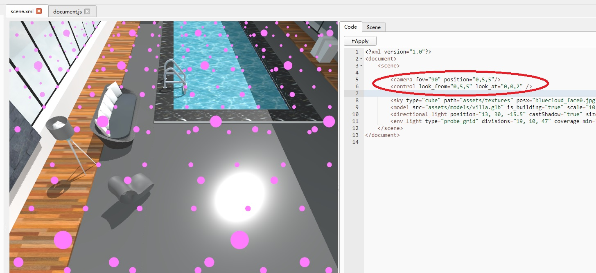

# Tutorials

## New Project


## New XML Scene


## Set-up sky


### Deploy sky-box images


## Delploy models

Here we just load a single GLB model that contains all the static objects.


## Setup directional light


## Global illumination - Deploy a probe-grid


## Scripting

Copy code from "project_template" to the project directory. (Skip project.json and scene.xml).


Create a target:


Double click the created target:


You can then do whatever change you want to the JavaScript code.

It is programmed against the [User Script APIs](api/index.html).


## Camera and Orbit Control settings

These are not part of the Scene editor UI.

Simply type into the XML code:




## Placing an avatar

Deploy the necessary models:


Insert the following code to the scene.xml:

```xml
<avatar src="assets/models/CyberbotGold.glb" name_idle="idle" name_forward="walk_forward" name_backward="walk_backward" camera_position="0.0, 1.5, -2.0" url_anim="assets/models/Animations.glb" fix_anims="fix_anims" position="0, 1.8, 2.5" rotation="0, -180, 0"/>
```

and the following code to scene.js

```js
// The code is necessary only when the animation track names doesn't match
// the joint names in the character model.
export function fix_anims(anims)
{
    for (let anim of anims)
    {
        if ("translations" in anim)
        {
            let translations = anim.translations;
            for (let trans of translations)
            {
                trans.name = "mixamorig:"+trans.name;
            }
        }
        
        if ("rotations" in anim)
        {
            let rotations = anim.rotations;
            for (let rot of rotations)
            {
                rot.name = "mixamorig:"+rot.name;
            }
        }
    }
}

```

## Using lightmaps

Using Lightmapper.exe, you can insert a 2nd UV set into villa.glb. In this way, we get villa_atlas.glb:


Create a new XML scene (scene2.xml) and copy \<sky\>, \<model\> and \<directional_light\> settings from scene.xml:


Modify villa.glb into villa_atlas.glb, the go to "Scene" tab:


Name the lightmap, then select "scene" in the Scene Graph, and click "Bake":


Modify scene.js so that scene2.xml gets load instead of scene.xml, when you double click "Target":


