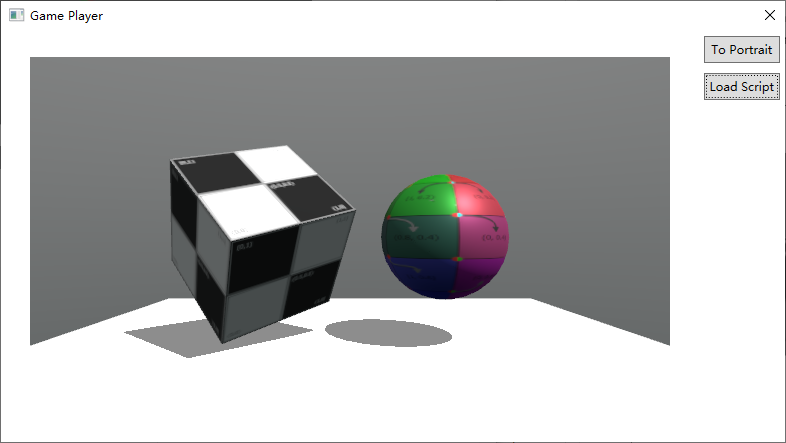

# Three.V8

Three.V8 was created as a proof of concept (POC) of an embedabble 3D rendering engine using JavaScript as user script.

The ongoing development targets mobile devices, tries to provide another JavaScript based application framework with 3D rendering as its core-function.

The source code here builds & runs on Windows, which can be used for evaluation or script development/debugging.

The Windows implementation requires Visual Studio 2019 or later to be built, becuase:

* V8 binary is acquired from [NuGet](https://www.nuget.org/packages/v8-v142-x64/)
* A C# WPF GUI is provided as an example of how to embed the engine.

## Subprojects

* ThreeEngine: C++ 3D rendering engine.
* Test.Cpp: Simple example using the C++ engine directly.
* Three.V8: V8 bindings of the 3D rendering engine.
* Test.V8: Simple example using the V8 engine.
* Three.V8.CLR: C# bindings of the V8 engine (itself) and OpenGL.
* GamePlayer: C# WPF GUI embedding the V8 engine.
* game: Example scripts. The math library and other utilities are borrowed directly from Three.js. Most assets are from [discoverthreejs.com](https://discoverthreejs.com/) and [sketchfab.com](https://sketchfab.com/tags/glb).

## 3rd-party libraries

* [V8](https://www.nuget.org/packages/v8-v142-x64): For running user script.
* [Three.js](https://threejs.org/): Reusing existing JS utilities.
* [tiny-gltf](https://github.com/syoyo/tinygltf): For loading GLTF models.
* [draco](https://github.com/google/draco): Mesh decoder. Used by tiny-gltf.
* [boost](https://www.nuget.org/packages/boost): For http(boost::beast).
* [boost::certify](https://github.com/djarek/certify): For https.
* [boost::url](https://github.com/CPPAlliance/url): For url processing.
* [openssl](https://www.nuget.org/packages/openssl): For https.
* [nanovg](https://github.com/memononen/nanovg): For embedded GUI subsystem.
* [stb_image](https://github.com/nothings/stb): For loading images.
* [glm](https://github.com/g-truc/glm): For geometry maths.
* [glew](https://github.com/nigels-com/glew): For OpenGL Wrangling.
* [bvh](https://github.com/madmann91/bvh): For acceleration of ray-casting.
* [crc64](https://github.com/srned/baselib): For state hashing.

## Building

Building is straightforward using Visual Studio 2019. Just make sure to resolve the git submodules first.

## Runing GamePlayer

Run the executable "GamePlayer\bin\Release\GamePlayer.exe":

The script "../../../game/bundle.js" is loaded by default. You can load your own script by clicking the button "Load Script".

The engine doesn't support ES6 modules eg. "import". User scripts need to be pre-bundled using bundlers like [rollup.js](https://rollupjs.org/)

## License
The source code is licensed under ['"Anti 996" License'](https://github.com/996icu/996.ICU/blob/master/LICENSE) by Fei Yang and Vulcan Eon (北京鲜衣怒马文化传媒有限公司).

## Documentation

[User Script APIs](docs/Index.md)

[Features and Code Snippets](docs/Features.md)