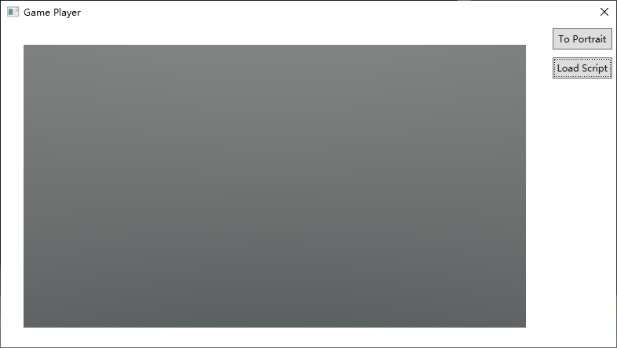

# Basic Routine

```js
import { OrbitControls } from "./controls/OrbitControls.js";
import { view } from "./view.js";

let renderer, scene, camera, controls;

function init(width, height)
{
    renderer = new GLRenderer();
    scene = new Scene();

    camera = new PerspectiveCamera(45.0, width / height, 0.1, 100.0);
    camera.setPosition(0.0, 0.0, 7.0);

    controls = new OrbitControls(camera, view);
    controls.enableDamping = true;

}

function dispose()
{    
    camera.dispose();
    scene.dispose();
    renderer.dispose();
}

function render(width, height, size_changed)
{
    if (size_changed) 
    {
        camera.aspect = width / height;
        camera.updateProjectionMatrix();
    }

    if (controls.hasOwnProperty('update'))
    {
        controls.update();
    }
    renderer.render(scene, camera);

}

setCallback('init', init);
setCallback('dispose', dispose);
setCallback('render', render);
```

In the basic routine above, we register 3 callback functions for `init`, `dispose`, `render` events. In addition, mouse events are recieved and dispatched by the imported `view` object. The `view` object serves as an event dispatcher. The OrbitControls object uses `view` to listen to the mouse events.

The basic routine contains a [GLRenderer](GLRenderer.html), a [Scene](Scene.html), and a [Camera](Camera.html). These are 
wrappers of engine objects. The classes are defined in native code. 

The each engine object has a `dispose` method, which can be called explictly to release the underlying resources before garbage collection.

The OrbitControls is an ordinary JS object. The class is defined in "./controls/OrbitControls.js". The code is directly ported from [Three.js](https://threejs.org/). There are other utilities from Three.js like Vector3, Matrix4, Quaternion, which we are going to use later.

Currently, [PerspectiveCamera](PerspectiveCamera.html) is the only option for camera, but can be easily extended in the future.

All scripts need to be pre-bundled. For exmaple:

```
rollup game.js --file bundle.js
```

To run a script, use GamePlayer to load the bundled script.

# Backgrounds

The Scene class has a [`.background`](Scene.html#background) property.

A background is optional in a Three.V8 Scene. It is possible to integrate background/foreground layers from outside the engine. 

When user choose to use a Three.V8 background, now we have the following options:

[ColorBackground](ColorBackground.html): Use a monotone color.

[CubeBackground](CubeBackground.html): Use a cubemap.

[HemisphereBackground](HemisphereBackground.html): Use a gradient change from sky-color to ground-color.

ColorBackground:

```js
bg = new ColorBackground();
bg.setColor(0.0, 0.52, 1.0);
scene.background = bg;
```

HemisphereBackground:

```js
bg = new HemisphereBackground();   
bg.setSkyColor(1.0, 1.0, 1.0);
bg.setGroundColor(0.02843, 0.07819, 0.07819);
scene.background = bg;
```

CubeBackground:

```js
bg = new CubeBackground();
let cube_img = imageLoader.loadCubeFromFile(
"assets/textures/sky_cube_face0.jpg", "assets/textures/sky_cube_face1.jpg",
"assets/textures/sky_cube_face2.jpg", "assets/textures/sky_cube_face3.jpg",
"assets/textures/sky_cube_face4.jpg", "assets/textures/sky_cube_face5.jpg");        
bg.setCubemap(cube_img);      
cube_img.dispose();
scene.background = bg;
```

For CubeBackground, the cubemap image is loaded using the global object [imageLoader](index.html#global-objects).

The effect when a HemisphereBackground is set-up:


# Models

Like Three.js, Three.V8 also has a scene graph, with the Scene object as the root. In Three.V8, we have cameras, lights, and models. However, unlike in Three.js, the scene graph in Three.V8 doesn't get all the way down to meshes. Models, as high-level objects, can have internal structures, which are preserved when a specific type of model is loaded. We believe this is good for efficiency, but the downside is that user only has limited access to the internal structures.

Currently, there are the following types of models:

[SimpleModel](SimpleModel.html): A Model containing a single simple geometry.

[GLTFModel](GLTFModel.html): A Model that has a GLTF style internal structure.

SimpleModel:

```js
import { Vector3 } from "./math/Vector3.js";

box = new SimpleModel();
box.name = "box";
box.createBox(2.0, 2.0, 2.0);
box.translateX(-1.5);
let axis = new Vector3(1.0, 1.0, 0.0);
axis.normalize();
box.rotateOnAxis(axis, 1.0);
{
    let img = imageLoader.loadFile("assets/textures/uv-test-bw.png");
    box.setColorTexture(img);
    img.dispose();
}
scene.add(box);

sphere = new SimpleModel();
sphere.name = "sphere";
sphere.createSphere(1.0);
sphere.translateX(1.5);
{
    let img = imageLoader.loadFile("assets/textures/uv-test-col.png");
    sphere.setColorTexture(img);
    img.dispose();
}
sphere.metalness = 0.5;
sphere.roughness = 0.5;
scene.add(sphere);

ground = new SimpleModel();
ground.createPlane(10.0, 10.0);    
ground.translateY(-1.7);
ground.rotateX(-3.1416*0.5);
scene.add(ground);
```

For SimpleModel, first create by "[new](SimpleModel.html#simplemodel)". Then, call one of the "[.create](SimpleModel.html#createbox)" functions to create geometry. For material, you can set base color by calling [.setColor](SimpleModel.html#setcolor), or [.setColorTexture](SimpleModel.html#setcolortexture) to set a base color map. The image is loaded using the global object [imageLoader](index.html#global-objects).

GLTFModel:

```js
model = gltfLoader.loadModelFromFile("../game/assets/models/RZYAS.glb");
model.setPosition(0, -8, 0); 
scene.add(model); 
```

For GLTFModel, the global object [gltfLoader](index.html#global-objects) should be used to create the model.

The effect when a few simple models are added to the scene:

Since that no lighting has been set, the models appear black.

# Indirect Lighting

In an open scene, we can use a global indirect light source to create a natural looking. Therefore, we put the indirect lighting before the direct lighting. A global indirect light source can be set through [`scene.indirectLight`](Scene.html#indirectlight). In contrary to Three.js, in Three.v8, an [IndirectLight](IndirectLight.html) is not an Object3D.

Currently we have to following options for indirect light source. 

[AmbientLight](AmbientLight.html): corresponding to ColorBackground. Monotone ambient light.

[EnvironmentMap](EnvironmentMap.html): corresponding to CubeBackground. Image based lighting.

[HemisphereLight](HemisphereLight.html): corresponding to HemisphereBackground. Gradient ambient light.

AmbientLight:

```js
envLight = new AmbientLight();
envLight.setColor(0.0, 0.52, 1.0);
scene.indirectLight = envLight;
```

EnvironmentMap:

```js
let cube_img = imageLoader.loadCubeFromFile(
"assets/textures/sky_cube_face0.jpg", "assets/textures/sky_cube_face1.jpg",
"assets/textures/sky_cube_face2.jpg", "assets/textures/sky_cube_face3.jpg",
"assets/textures/sky_cube_face4.jpg", "assets/textures/sky_cube_face5.jpg");

let envMapCreator = new EnvironmentMapCreator();
envLight = envMapCreator.create(cube_img);
scene.indirectLight = envLight;
envMapCreator.dispose();
cube_img.dispose();
```

You can use the same CubeImage for both the background and the indirect light of the scene, before disposing it.

HemisphereLight:

```js
envLight = new HemisphereLight();
envLight.setSkyColor(1.0, 1.0, 1.0);
envLight.setGroundColor(0.02843, 0.07819, 0.07819);
scene.indirectLight = envLight;
```

The effect after setting a HemisphereLight:


# Direct Lighting

Direct light sources are explict light emitting 3d objects placed into the scene.

Currently we have to following options for direct light source. 

[DirectionalLight](DirectionalLight.html): A light that gets emitted in a specific direction. This light will behave as though it is infinitely far away and the rays produced from it are all parallel. 

DirectionalLight:

```js
directional_light = new DirectionalLight();
directional_light.intensity = 4.0;
directional_light.setPosition(5.0, 10.0, 5.0);
directional_light.setShadow(true, 4096, 4096);
directional_light.setShadowProjection(-10.0, 10.0, -10.0, 10.0, 0.0, 50.0);
scene.add(directional_light);
```

The DirectionalLight points from its position to target.position. The default position of the target is (0, 0, 0). Shadow is optional. When it is enabled. The projection parameters needs to be carefully specified as the shadow-map covers only a limited area.

The effect after adding a DirectionalLight, without shadow:


The effect after enabling shadow:


# Animation

Animation features are enabled on a per model basis. 

Currently, only GLTFModel has the animation features.

## Animation Clip Management

Animation clips are owned by each model. When a model is loaded, the animations clips are also loaded if they are present

[`GLTFModel.addAnimation`](GLTFModel.html#addanimation) and [`GLTFModel.addAnimations`](GLTFModel.html#addanimations): add more animation clips to a model. These animation clips might be loaded separately.

## Animation Control

First, a static pose can be specified without involving any animation clip.

[`GLTFModel.setAnimationFrame`](GLTFModel.html#setanimationframe): specify the state of each movable parts.

Second, the play/stop state of each animation clip can be controlled separately. 

[`GLTFModel.playAnimation`](GLTFModel.html#playanimation): start playing an animation clip.

[`GLTFModel.stopAnimation`](GLTFModel.html#stopanimation): stop playing an animation clip.

In order to have the animation clip being played to take effect, call [`GLTFModel.updateAnimation`](GLTFModel.html#updateanimation) from the `render` callback function.

The following code loads the Parrot model and starts the animation that comes with the model:

```js
model = gltfLoader.loadModelFromFile("../game/assets/models/Parrot.glb");
model.playAnimation("KeyAction");
```


# Ray Casting

Accelerated ray-casting is most handy for basic physical simulation such as collision detection. Three.V8 provides a [BoundingVolumeHierarchy](BoundingVolumeHierarchy.html) helper class to accelerate ray-geometry intersection calculation, which is powered by the [bvh](https://github.com/madmann91/bvh) library.

The [constructor](BoundingVolumeHierarchy.html#boundingvolumehierarchy) creates a bvh acceleration structure from a list of 3d objects. 

The [.intersect](BoundingVolumeHierarchy.html#intersect) method intersects the accleration structure with a given ray. Both input and output are expressed using ordinary JS objects.

# Network Sub-system

To provide a usable app framework, networking functionality is necessary.

Currently, Three.V8 only support basic HTTP-Get requests.

The global object [http](index.html#global-objects) provides 2 methods:

* [`get()`](HttpClient.html#get): for synchronized HTTP-Get.
* [`getAsync()`](HttpClient.html#getasync): for asynchronized HTTP-Get.

Both `get` methods supports binary and text(utf-8 encoded) modes.

`getAsync()` uses callback. To convert it into an actual async function, use the following code-snippet:

```js
function httpGetAsync(url, is_text)
{
    return new Promise((resolve, reject) => {
        http.getAsync(url, is_text, (suc, data)=>
        {
            resolve(data);
        });
    });
}
```

The returned `ArrayBuffer` can then be used with [`ImageLoader`](ImageLoader.html) or [`GLTFLoader`](GLTFLoader.html).

# GUI Sub-system

Again, to provide a usable app framework, GUI functionality is necessary.

Currently, Three.V8 provides a minimalism GUI sub-system which is embedded into the 3D rendering flow.

The system is incomplete. It doesn't include any layout calculation. The position and size of each ui element need to be explicitly specified by user. The up-side of this is that the ui elements are very accurately positioned, and behaves consistently across different devices.

## Structure


Each script context has a single `UIManager` object. The `UIManager` manages one or more `UIArea` objects, each contains multiple `UIElement` objects.

Each `UIArea` maintains a framebuffer where the ui-elements are rendered. 

The `UIManager` processes all the Mouse/Touch/Keyboard inputs by traversing each `UIArea` and `UIElement`.

While all ui-elements are directly owned by an `UIArea`, they can be geometrically nested.

The geometry relationship can be specified using `UIElement.block`. The `block` property specifies the geometry parent of an element.

In the hierachy of `UIElement` classes:


only those derived from `UIBlock` can be used as `UIElement.block`, which means the other ui-elements can only be the leaf elements.

## Example


```js
function setupUI()
{
    if (!gamePlayer.hasFont("default"))
    {
        gamePlayer.createFontFromFile("default", "assets/fonts/NotoSansSC-Bold.otf");
    }

    ui_area = new UIArea();
    ui_area.setOrigin(15.0, 30.0);
    ui_area.setSize(320.0, 480.0);
    UIManager.add(ui_area);

    panel2 = new UIPanel();
    panel2.setOrigin(0.0, 0.0);
    panel2.setSize(300.0, 200.0);
    ui_area.add(panel2);

    {
        text_msg = new UIText();
        text_msg.text = "Accurate GUI Layout";
        text_msg.block = panel2;
        text_msg.setStyle({ "alignmentVertical": 0});
        text_msg.setOrigin(0.0, 30.0);    
        ui_area.add(text_msg); 

        edit = new UILineEdit();
        edit.setOrigin(50.0, 60.0);
        edit.block = panel2;
        edit.text = "你好ABC，Can you see me?";
        ui_area.add(edit);

        btn = new UIButton();
        btn.setOrigin(50.0, 120.0);
        btn.setSize(90.0, 40.0);
        btn.block = panel2;    
        btn.onClick = ClearUI;
        ui_area.add(btn);        
        {

            img = imageLoader.loadFile("assets/textures/ok.png");
            btn_img = new UIImage();
            btn_img.setImage(img);
            btn_img.block = btn;
            btn_img.setSize(30,30);
            ui_area.add(btn_img);

            btn_text = new UIText();
            btn_text.text = "OK";
            btn_text.block = btn;
            btn_text.setStyle({ "alignmentHorizontal": 0 });
            btn_text.setOrigin(40.0, 0.0); 
            btn.onLongPress = () =>
            {
                print("Long Press");
            }   
            ui_area.add(btn_text); 
        }

        btn2 = new UIButton();
        btn2.setOrigin(150.0, 120.0);
        btn2.setSize(110.0, 40.0);
        btn2.block = panel2;
        btn2.onClick = ClearUI;
        ui_area.add(btn2);
        {        
            img2 = imageLoader.loadFile("assets/textures/cancel.png");
            btn_img2 = new UIImage();
            btn_img2.setImage(img2);
            btn_img2.block = btn2;
            btn_img2.setSize(30,30);
            ui_area.add(btn_img2);

            btn_text2 = new UIText();
            btn_text2.text = "Cancel";
            btn_text2.block = btn2;
            btn_text2.setStyle({ "alignmentHorizontal": 0 });
            btn_text2.setOrigin(40.0, 0.0);
            ui_area.add(btn_text2);   
        }
    }

    sview = new UIScrollViewer();    
    sview.setOrigin(0.0, 220.0);
    sview.setSize(280.0, 240.0);    
    ui_area.add(sview); 
    {
        picture = new UIImage();
        picture.block = sview;
        {
            img3 = imageLoader.loadFile("assets/textures/uv-test-col.png");            
            picture.setImage(img3);
            picture.setSize(180,180);
        }        
        ui_area.add(picture);
        sview.setContentSize(200,400);

        btn3 = new UIButton();
        btn3.block = sview;
        btn3.setOrigin(20, 200);
        btn3.setSize(100.0, 40.0);
        ui_area.add(btn3);
        {
            btn_text3 = new UIText();
            btn_text3.text = "Test1";
            btn_text3.block = btn3;                       
            ui_area.add(btn_text3);   
        }

        btn4 = new UIButton();
        btn4.block = sview;
        btn4.setOrigin(20, 250);
        btn4.setSize(100.0, 40.0);
        ui_area.add(btn4);
        {
            btn_text4 = new UIText();
            btn_text4.text = "Test2";
            btn_text4.block = btn4;                       
            ui_area.add(btn_text4);   
        }
    }
}
```
